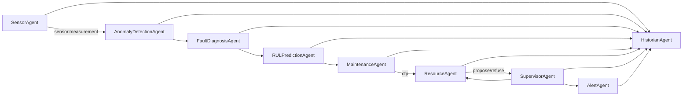
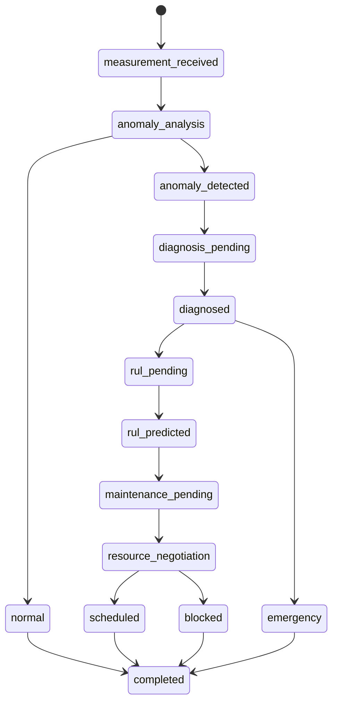
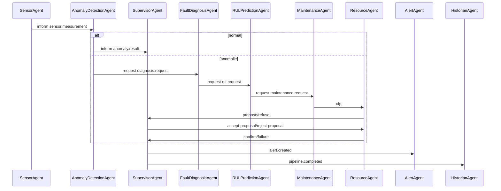
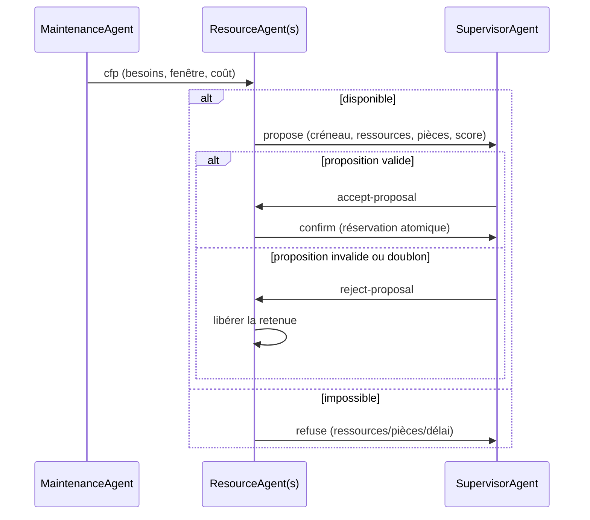
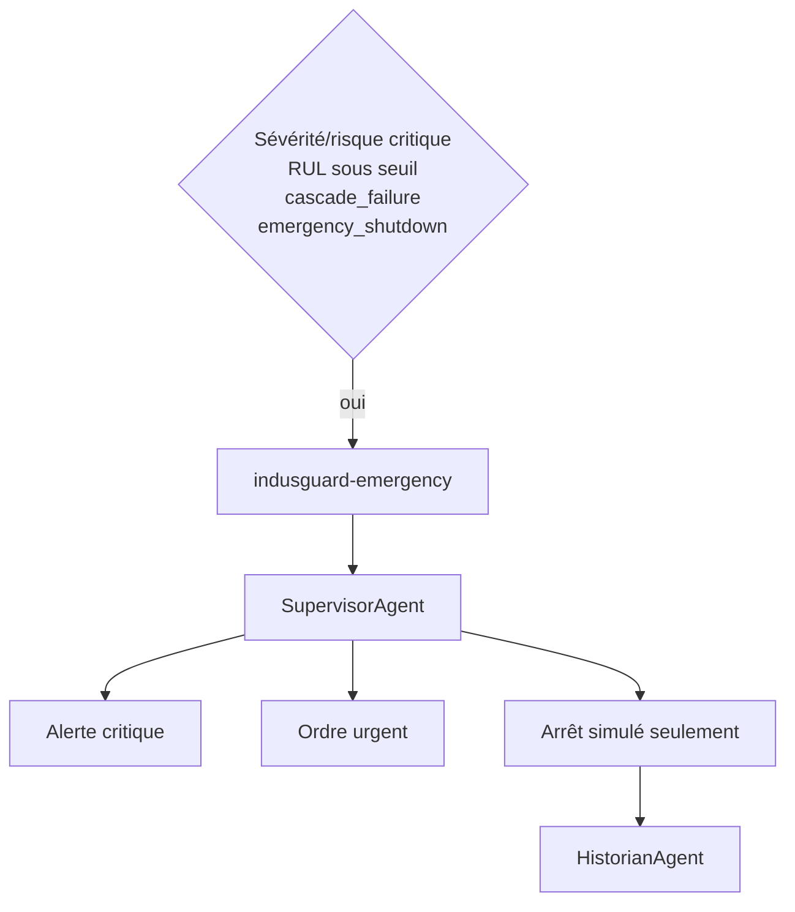

# Phase 6 — système multi-agents SPADE, PyJabber et XMPP

## Objectif et architecture

La phase 6 distribue les analyses existantes sans recopier leurs algorithmes. SPADE gère le cycle de vie et les comportements, PyJabber fournit le serveur local embarqué, XMPP transporte les stanzas, FIPA-ACL exprime l'intention, JSON UTF-8 porte les données et le Contract Net Protocol négocie les ressources.



Le mode `embedded` appelle `spade.run(main(), embedded_xmpp_server=True)`. PyJabber écoute localement, conserve sa base en mémoire et les agents démarrent avec `auto_register=True`. Le mode `external` n'instancie pas PyJabber; domaine, JID, mot de passe et auto-enregistrement viennent de la configuration et de l'environnement.

## Agents et comportements

- `SensorAgent` lit le CSV chronologiquement, filtre scénario/équipement et publie en batch, accéléré ou simulation temps réel.
- `AnomalyDetectionAgent` utilise les seuils et le modèle Isolation Forest Phase 2.
- `FaultDiagnosisAgent` appelle les règles et Random Forest hybrides Phase 3.
- `RULPredictionAgent` conserve une deque bornée par équipement, calcule seulement des features causales et appelle les modèles Phase 4.
- `MaintenanceAgent` appelle le service Phase 5 et initie le Contract Net.
- `ResourceAgent` vérifie compétences, créneaux et pièces; une retenue temporaire empêche les propositions concurrentes de sur-allouer le stock.
- `SupervisorAgent` suit les états, accepte/refuse, déduplique les dossiers métier et simule les urgences.
- `AlertAgent` applique un cooldown et écrit console/CSV. Email, SMS et Slack sont des interfaces non implémentées.
- `HistorianAgent` persiste la chaîne reconstructible.

`CyclicBehaviour` reçoit les messages routés par `Template`, `PeriodicBehaviour` publie les heartbeats et `OneShotBehaviour` charge/publie/finalise un scénario. La machine d'états du superviseur reste explicite dans un dictionnaire par trace, plus lisible qu'un FSM imbriqué pour cette version.



## Messages FIPA-ACL

Chaque `spade.message.Message` contient un corps JSON `AgentMessage` et les métadonnées `performative`, `ontology`, `protocol`, `conversation-id`, `language`, `message-type`, `schema-version`, `priority`, `trace-id`, `correlation-id` et `message-id`. SPADE 4.1.4 n'expose pas `FIPAMessageBuilder`/`FIPAMessageParser`; la phase utilise donc ses `Message` et `Template` natifs avec une fabrique et un parseur validé équivalents. La fabrique conserve trace, corrélation et conversation sur toute la chaîne. La validation impose UUID, horodatage zoné, version 1.0, type d'équipement, type de message, priorité, taille maximale et liste blanche des expéditeurs.

Performatives : `inform`, `request`, `query-if`, `cfp`, `propose`, `accept-proposal`, `reject-proposal`, `confirm`, `refuse`, `failure`, `not-understood`, `cancel`. Ontologies : surveillance, anomalie, diagnostic, RUL, maintenance, ressources, supervision, alerting, historian et santé. Protocoles : `indusguard-pipeline`, `fipa-request`, `fipa-contract-net`, `indusguard-emergency`, `indusguard-heartbeat`.



## Contract Net Protocol



Le protocole autorise plusieurs ResourceAgent futurs. Le superviseur vérifie disponibilité, pièces, échéance, score, coût et priorité. Les identifiants de techniciens restent génériques.

## Urgence simulée



Aucune commande physique n'est émise. L'« arrêt » est une décision de simulation et un événement historisé.

## Registre des actifs, santé et fiabilité

`configs/assets.yaml` définit les actifs canoniques, alias, ligne et relation parent-enfant. `AssetRegistry` reconnaît aussi les anciens IDs en majuscules, les IDs `*-RUL-*` et les `*_run_*` sans réécrire les datasets.

Chaque agent publie périodiquement statut, compteur, erreurs, taille de file et latence moyenne. `HealthMonitor` compare le dernier timestamp au seuil. Un agent absent produit incident, timeout, retries et dead letter.

Le cache LRU/TTL indexé par `message_id` empêche de répéter l'action. Le superviseur ajoute une clé métier équipement+panne pour éviter plusieurs ordres sur une rafale d'anomalies. Les retries suivent un délai exponentiel borné; après le maximum, l'enveloppe originale et l'erreur sont écrites dans `dead_letter_messages.jsonl`. Aucun `eval`, commande reçue, pickle réseau ou désérialisation non sûre n'est utilisé.

## Traçabilité, métriques et visualisations

`messages.jsonl` conserve les enveloppes; `events.csv`, `decisions.csv`, `alerts.csv` et `agent_health.csv` utilisent les colonnes contractuelles. `multi_agent_metrics.json` contient volumes, succès, erreurs, doublons, timeouts, retries, DLQ, résultats métier, négociations, alertes, heartbeats, latences moyenne/P50/P95, débit et traces.

Douze PNG couvrent messages par agent/type, latences, succès, fiabilité, santé, chronologie d'une trace, priorités, alertes, propositions et graphe des communications. Chaque figure est fermée après sauvegarde.

## Exécution et tests

```bash
python run_multi_agent_system.py --scenario normal
python run_multi_agent_system.py --scenario bearing_wear --speed 20
python run_multi_agent_system.py --scenario pump_cavitation
python run_multi_agent_system.py --scenario emergency
python run_multi_agent_system.py --scenario resource_unavailable
python run_multi_agent_system.py --scenario part_unavailable
python run_multi_agent_system.py --scenario agent_unavailable
python run_multi_agent_system.py --scenario duplicate
python run_multi_agent_demo.py
python check_agent_health.py
python replay_agent_trace.py --trace-id UUID
python benchmark_multi_agent.py
python -m pytest -q -m "not integration"
python -m pytest -q -m integration
```

Les tests rapides valident contrats, métadonnées, Templates, adaptateurs, registres, idempotence, retries, DLQ, protocoles et classes sans serveur externe. Le test `integration` lance PyJabber dans un sous-processus, auto-enregistre deux agents, force le chemin réseau XMPP, vérifie le corps reçu et ferme les agents. L'isolation évite que `spade.run` ferme la boucle pytest sous Windows.

## Sécurité, limites et suites

Le mot de passe n'est jamais dans YAML ni Git; le fallback `indusguard-local-dev` n'est permis qu'en embedded. En external, la variable est obligatoire. `.env` est ignoré. Les messages sont bornés, les expéditeurs filtrés et les secrets exclus des journaux.

PyJabber embarqué est adapté au développement, pas à la haute disponibilité. Les ressources, coûts et arrêts sont synthétiques. Le scheduler reste heuristique, la persistance CSV/JSONL n'offre pas les transactions d'une base industrielle et un modèle prédictif dépend de la représentativité des données. Les suites possibles sont un XMPP durci, stockage transactionnel, plusieurs ResourceAgent, observabilité distribuée, authentification par certificats et solveur d'ordonnancement, toujours avec validation humaine avant tout usage réel.
